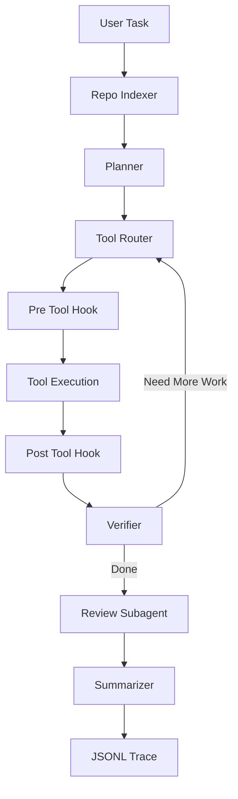

# Coding Agent SFT Lab

一个面向简历项目和后训练实验的轻量级 **Code Repository Agent + Qwen3.5-2B LoRA SFT + DAPO-style Agentic RL** 项目。

项目包含三部分：

1. **Code Agent 原型**：参考 Claude Code / Aider / OpenHands 的公开思路，实现仓库扫描、检索、规划、工具调用、测试验证、Review Subagent 和 JSONL trace 记录。
2. **Agent SFT 实验闭环**：将 Agent 工具轨迹、MBPP/HumanEval、SWE-bench Lite plan 数据转换为 LLaMA-Factory 训练格式，并基于 Qwen3.5-2B 做 LoRA SFT，对比微调前后效果。
3. **DAPO 增强型 GRPO**：从正式 SFT Adapter 继续训练共享 Actor，在独立临时仓库中执行多轮工具交互，以环境独立测试和文件完整性计算奖励，统一比较 SFT 与 SFT+DAPO-GRPO。

SFT 后的唯一推荐云端流程、准确命令、奖励权重及恢复方法见 [Agentic RL Runbook](AGENTIC_RL_RUNBOOK.md)。
顺序为 **正式 SFT Adapter 检查 → RL 环境预检 → GRPO Smoke 及证据检查 → 正式 RL → validation 比较 → 冻结后的最终 test**。
原有 [SFT Runbook](TRAINING_RUNBOOK.md) 可独立使用；不要求运行 RL。

RL 使用 TRL 公开 DAPO Token-level loss、Clip-Higher 和技术截断过滤，并加入仅统计模型 Token 的柔性长度惩罚。
没有完整 Dynamic Sampling，不声称完整复现 DAPO。第一版支持单 GPU、保守 Python 函数任务和隔离 pytest；
不支持任意 SWE 仓库。现有 SFT 数据及 RAG 核心不变，训练/验证/最终测试按 task/group 隔离。
CPU 验收入口：`bash scripts/final_rl_preflight.sh`（需 pytest）。包含真实隔离 pytest 和无模型 Canary；当前后端为轻量隔离。
原始测试划分为 518 条公开、364 条隐藏断言；隐藏验证只在轨迹结束后执行。尚无真实 GPU Smoke、GRPO 或模型评测指标。

> 说明：本仓库不包含任何私有 API、模型权重、训练 checkpoint 或个人路径。模型权重和训练输出请按文档本地生成。

---

## 项目亮点

- 支持 AST/tree-sitter 代码切分、增量向量索引、BM25 + Dense 混合检索及代码感知 rerank。
- 使用 LangGraph 编排 Planner → Tool Execution → Verifier → Review → Summary 流程。
- 通过 Tool Registry 统一封装 `read_file`、`grep`、`replace_in_file`、`write_file`、`run_tests`、`git_diff` 等工具。
- 内置 Hook 安全边界，阻止越权路径、危险命令和敏感文件修改。
- 每次 Agent 运行可保存 JSONL trace，用于后续 SFT 数据构建。
- 提供 LLaMA-Factory 数据转换、Qwen3.5-2B LoRA SFT 和 Base/SFT Test 对比评估脚本。
- 给出完整简历项目写法，展示一个 AI Agent 后训练项目从 0 到 1 的组织方式。

---

## 架构



核心模块：

| 模块 | 文件 | 作用 |
| --- | --- | --- |
| RAG | `src/cc_agent/rag.py` | 结构化切分、增量索引、Hybrid 召回、rerank、依赖图与上下文组装 |
| Retrieval Eval | `src/cc_agent/retrieval_eval.py` | 计算 Recall@K、HitRate@K 和 MRR |
| Repo Indexer | `src/cc_agent/repo_indexer.py` | 扫描仓库、读取规则、提取 Python 符号、组装检索上下文 |
| Planner / Actor / Reviewer | `src/cc_agent/graph.py` | LangGraph 工作流编排 |
| Shared Actor | `src/cc_agent/actions.py` | 交互式 Graph 与 RL 共用提示词、JSON 动作执行入口 |
| Agentic RL | `src/cc_agent/rl/` | 协议、隔离环境、多轮 mask、奖励、TRL 接入、manifest、恢复和统一评测 |
| Tool Registry | `src/cc_agent/tools.py` | 文件、搜索、编辑、测试、diff 工具封装 |
| Hook System | `src/cc_agent/hooks.py` | 路径、安全命令、敏感文件保护 |
| Trace | `src/cc_agent/tracing.py` | 保存 JSONL 工具轨迹 |
| Trace Stats | `src/cc_agent/trace_stats.py` | 汇总工具成功率、测试通过率、编辑次数 |
| CLI | `src/cc_agent/cli.py` | 命令行入口 |

---

## 目录结构

```text
.
├── src/cc_agent/                  # Code Agent 核心源码
│   └── rl/                        # DAPO-style Agentic RL
├── scripts/                       # 数据转换、模型下载、训练、评估脚本
├── examples/                      # 可运行的小型样例仓库和 benchmark task
├── data/
│   ├── tasks/                     # 任务清单样例
│   ├── sft/                       # SFT JSONL 样例数据
│   ├── llamafactory/              # LLaMA-Factory alpaca 格式样例数据
│   └── repos/                     # MBPP / HumanEval 生成的小型仓库样例
├── docs/                          # 实验报告和简历写法
├── run_agent.py                   # CLI wrapper
├── requirements.txt
├── pyproject.toml
└── .env.example
```

以下内容默认不入库：`outputs/`、`models/`、`traces/`、`logs/`、`.env`、`.cache/`、`*.safetensors`、`*.log`。

---

## 环境准备

建议使用 Python 3.10+。如果你使用 conda：

```bash
conda create -n coding_agent_sft python=3.10 -y
conda activate coding_agent_sft
pip install -r requirements.txt
```

如需对 JavaScript、TypeScript、Java、Go、Rust、C/C++、Ruby 使用 tree-sitter 结构化切分：

```bash
pip install -e ".[rag]"
```

未安装该可选依赖时会自动回退到滑动窗口切分，不影响 Python AST 切分和 Agent 运行。

配置模型 API：

```bash
cp .env.example .env
```

编辑 `.env`：

```bash
CC_AGENT_LLM_PROVIDER=openai
OPENAI_API_KEY=sk-your-api-key
OPENAI_BASE_URL=https://api.openai.com/v1
OPENAI_MODEL=gpt-4o-mini
OPENAI_TEMPERATURE=0.1

CC_AGENT_RETRIEVAL_MODE=hybrid
RAG_EMBEDDING_PROVIDER=openai
RAG_EMBEDDING_MODEL=text-embedding-3-small
RAG_CONTEXT_MAX_TOKENS=2000
RAG_RERANKER=heuristic
RAG_GIT_CHANGE_BOOST=0.02
```

`OPENAI_BASE_URL` 可以替换为任何 OpenAI-compatible API 服务地址。

Hybrid RAG 默认复用 `OPENAI_API_KEY` 和 `OPENAI_BASE_URL`。如果聊天与 Embedding 使用不同服务，单独设置
`RAG_EMBEDDING_API_KEY` 和 `RAG_EMBEDDING_BASE_URL`。首次检索会为目标仓库生成 Embedding，并将向量索引保存到
`~/.cache/cc-agent/rag`；仓库内容和切分配置未变化时会直接复用索引。

查询时会分别执行 Chunk 级 BM25 和 Dense 语义召回，再通过 Reciprocal Rank Fusion 合并排名。代码标识符会额外
加权，最终上下文按照近似 token 预算进行重叠去重和截断。`retrieve` 命令及 Agent 的 `retrieve_context` 工具支持
`path`、`language` 和 `symbol` 元数据过滤。

索引更新采用 Chunk ID 级增量策略：仓库变化后只重新生成新增或修改 Chunk 的 Embedding。RRF 候选随后经过独立
代码感知 reranker，根据查询词覆盖度、Git 工作区变更以及 Python import 直接依赖关系调整顺序。

如果当前 OpenAI-compatible 服务不支持 Embedding API，可临时设置
`CC_AGENT_RETRIEVAL_MODE=lexical` 使用旧的词法检索。

---

## 运行 Code Agent

### 1. 只预览仓库上下文

```bash
python run_agent.py index --repo examples/sample_repo --query "subtract bug"
```

### 2. 单独运行 Hybrid RAG 检索

```bash
python run_agent.py retrieve --repo examples/sample_repo --query "subtract function" --top-k 3
```

可选的过滤示例：

```bash
python run_agent.py retrieve \
  --repo examples/sample_repo \
  --query "calculator bug" \
  --language python \
  --symbol subtract
```

### 3. 运行完整 Agent

```bash
python run_agent.py run \
  --repo examples/sample_repo \
  --task "修复 subtract 函数的错误实现" \
  --test-command "pytest -q"
```

每次完整运行会在 `traces/` 目录生成 JSONL 轨迹。轨迹包含计划、工具调用、工具结果、Review 结论和最终总结，可用于后续 SFT。

### 4. 评估 RAG 检索质量

仓库提供了一个最小 JSONL 检索集，可计算 Recall@K、HitRate@K 和 MRR：

```bash
python run_agent.py eval-retrieval \
  --dataset examples/retrieval_eval.jsonl \
  --ks 1,3,5
```

每条样本包含 `repo`、`query`、`relevant_paths`，并可选提供 `relevant_symbols`。真实实验应继续扩充查询和人工相关性标注。

### 5. 查看 trace 统计

```bash
python run_agent.py stats --path traces
```

---

## 构建 SFT 数据

本项目支持三类数据源：

| 数据源 | 用途 | 输出 |
| --- | --- | --- |
| MBPP | 入门级 Python 编程任务 | 小型 repo + task manifest + SFT JSONL |
| HumanEval | 函数级代码生成任务 | 小型 repo + task manifest + SFT JSONL |
| SWE-bench Lite | 真实 GitHub issue 元数据 | issue → plan / patch SFT 数据 |

### 1. 构建 MBPP / HumanEval 数据

```bash
python run_agent.py build-mbpp --limit 20
python run_agent.py build-humaneval --limit 20
```

如果无法访问外网，代码会生成少量 offline seed 样本，方便先跑通流程。

### 2. 构建 SWE-bench Lite 任务清单

```bash
export HF_ENDPOINT=https://hf-mirror.com
python run_agent.py build-swebench-lite --limit 20
```

### 3. 将 SWE-bench Lite 转成 SFT

生成修复计划数据：

```bash
python run_agent.py swebench-to-sft \
  --input data/tasks/swebench_lite_tasks.jsonl \
  --output data/sft/swebench_lite_plan_sft.jsonl \
  --mode plan
```

生成 patch 数据：

```bash
python run_agent.py swebench-to-sft \
  --input data/tasks/swebench_lite_tasks.jsonl \
  --output data/sft/swebench_lite_patch_sft.jsonl \
  --mode patch
```

### 4. 将 Agent traces 转成 SFT

```bash
python run_agent.py traces-to-sft --trace-path traces --output data/sft/agent_traces_sft.jsonl
```

### 5. 校验 SFT 数据

新生成的样本使用统一的 `instruction`、`input`、`output` 结构，并显式携带 `task_type`：
`tool_call`、`tool_strategy`、`swebench_plan` 或 `swebench_patch`。旧数据缺少该字段时仍可按输出结构推断。

校验原始 JSONL 和转换后的 LLaMA-Factory Alpaca 数据：

```bash
python scripts/validate_sft_data.py --strict
```

要求所有样本均已迁移为显式协议时：

```bash
python scripts/validate_sft_data.py --strict --require-explicit-task-type
```

---

## LLaMA-Factory SFT 实验

### 1. 准备 LLaMA-Factory 数据

```bash
python scripts/prepare_llamafactory_sft.py
```

需要重建并回写五类默认源数据中的可自动修复问题时：

```bash
python scripts/prepare_llamafactory_sft.py --rewrite-clean-sources
```

脚本固定使用随机种子 `42`，先精确去重，再按任务 ID、Issue ID 或 Trace 任务来源分组，按
90%/5%/5% 生成 Train/Validation/Test；同一任务不会跨集合。SWE-bench Patch 默认不参与，只有显式传入
`--include-patch` 时才会加入。

输出：

```text
data/llamafactory/train_alpaca.json
data/llamafactory/val_alpaca.json
data/llamafactory/test_alpaca.json
data/llamafactory/smoke_alpaca.json
data/llamafactory/dataset_info.json
data/llamafactory/dataset_stats.json
```

当前样例统计：

| 数据集 | 数量 |
| --- | ---: |
| 总样本 | 724 |
| 训练集 | 652 |
| 验证集 | 36 |
| 测试集 | 36 |
| Smoke（训练集子集） | 32 |

### Qwen3.5-2B：4090D Smoke 与正式训练

Qwen3.5-2B 使用 LLaMA-Factory `0.9.5` 的 `qwen3_5_nothink` 模板。推荐依赖组合记录在
`requirements-qwen3_5-sft.txt`；PyTorch 应按 4090D 机器的 CUDA 版本单独安装。两套配置均设置
`train_on_prompt: false`，只对 assistant 输出计算损失。

本地 CPU 可先运行不加载模型的静态检查：

```bash
python scripts/check_sft_environment.py \
  --config configs/qwen3_5_2b_smoke.yaml \
  --static-only
```

4090D 上的唯一推荐执行流程、命令顺序和交付文件见 [`TRAINING_RUNBOOK.md`](TRAINING_RUNBOOK.md)。

Smoke 固定读取 32 条 `coding_agent_smoke` 并执行 2 个优化器 Step，输出到
`outputs/qwen3_5_2b_smoke_lora`；正式训练读取 Train/Validation、训练 1 个 Epoch，输出到
`outputs/qwen3_5_2b_lora_sft`。启动脚本会拒绝两者使用同一输出目录。

### Legacy：Qwen3-8B 实验路径

以下安装、下载、训练脚本属于早期 Qwen3-8B 实验，仅为兼容和历史追溯保留，**不属于当前推荐流程**。
它们不得与 Qwen3.5-2B 的 Smoke、正式 Adapter 或 Test 评测结果混用。

#### 安装旧实验依赖

```bash
bash scripts/install_llamafactory.sh
```

验证：

```bash
llamafactory-cli --help
```

#### 下载 Qwen3-8B（legacy）

```bash
bash scripts/download_qwen_model.sh
```

默认下载到：

```text
models/Qwen3-8B
```

如果你的磁盘空间有限，可以自定义路径：

```bash
LOCAL_DIR=/path/to/models/Qwen3-8B bash scripts/download_qwen_model.sh
```

#### 启动 Qwen3-8B LoRA SFT（legacy）

```bash
LOCAL_MODEL_DIR=models/Qwen3-8B \
CUDA_VISIBLE_DEVICES=0 \
bash scripts/train_qwen_supported_llamafactory_lora.sh
```

训练输出默认保存到：

```text
outputs/qwen_supported_coding_agent_lora_llamafactory
```

关键训练配置：

| 参数 | 值 |
| --- | --- |
| Base model | `Qwen/Qwen3-8B` |
| Method | LoRA SFT |
| LoRA rank / alpha | 8 / 32 |
| Effective batch size | 16 |
| cutoff_len | 4096 |
| learning rate | `1e-4` |
| epoch | 1 |
| dtype | bf16 |

---

## Legacy Qwen3-8B 历史评估

以下指标与结果只描述旧实验，未由当前 Qwen3.5-2B 评测闭环复现，不应作为当前结果引用。
当前评测命令只收录在 [`TRAINING_RUNBOOK.md`](TRAINING_RUNBOOK.md)。

评估指标：

| 指标 | 含义 |
| --- | --- |
| `json_valid_rate` | 输出是否为合法 JSON |
| `field_hit_rate` | 必填字段是否存在，例如 `plan/tool/arguments` |
| `rouge_l` | 与参考答案的 ROUGE-L F1 |
| `tool_accuracy` | 工具调用任务中 tool 名称是否正确 |
| `file_mention_rate` | SWE-bench plan 中是否命中关键文件 |
| `patch_format_rate` | patch 任务中是否包含 unified diff 标记 |

一次实验结果：

| 指标 | Base | SFT | 提升 |
| --- | ---: | ---: | ---: |
| JSON 格式正确率 | 0.0% | 94.6% | +94.6% |
| 必填字段命中率 | 1.4% | 94.6% | +93.2% |
| ROUGE-L | 10.1% | 73.1% | +63.0% |
| Tool 选择准确率 | 0.0% | 83.3% | +83.3% |
| 文件命中率 | 7.7% | 38.5% | +30.8% |

结果解读：这个提升主要说明 SFT 显著增强了模型对 **Agent 输出协议和 JSON 格式** 的遵循能力；它不等同于真实复杂代码修复能力已经同幅度提升。更严格的下一步应加入 held-out 测试集、真实 patch 执行和端到端 Agent loop 评估。


---

## 简历写法参考

更完整版本见 `docs/RESUME_PROJECT_TEMPLATE.md`。

简历 bullet 示例：

> 构建面向代码仓库任务的轻量级 Coding Agent，支持仓库索引、代码检索、任务规划、工具调用、测试执行、Review Subagent 和 JSONL 轨迹记录；进一步将 Agent traces、MBPP/HumanEval 和 SWE-bench Lite 数据统一为可校验、无任务泄漏的 LLaMA-Factory SFT 数据，建立 Qwen3.5-2B LoRA 的 Smoke、正式训练与 held-out Test Base/SFT 对比评测闭环。真实训练及评测结果需在 4090D 完成后填写。

---

## 后续扩展

- 扩充人工标注的检索评估集，并对 Dense、BM25、Hybrid、rerank 做消融实验。
- 可选接入 Cross-Encoder reranker，与当前轻量代码感知 reranker 对比。
- 扩充高质量真实 Agent traces，减少模板化过拟合。
- 将 patch 样本纳入评估，增加真实测试执行指标。
- 在现有 DAPO-style Agentic RL 上研究 Dynamic Sampling、更广任务沙箱和更多策略优化算法。
